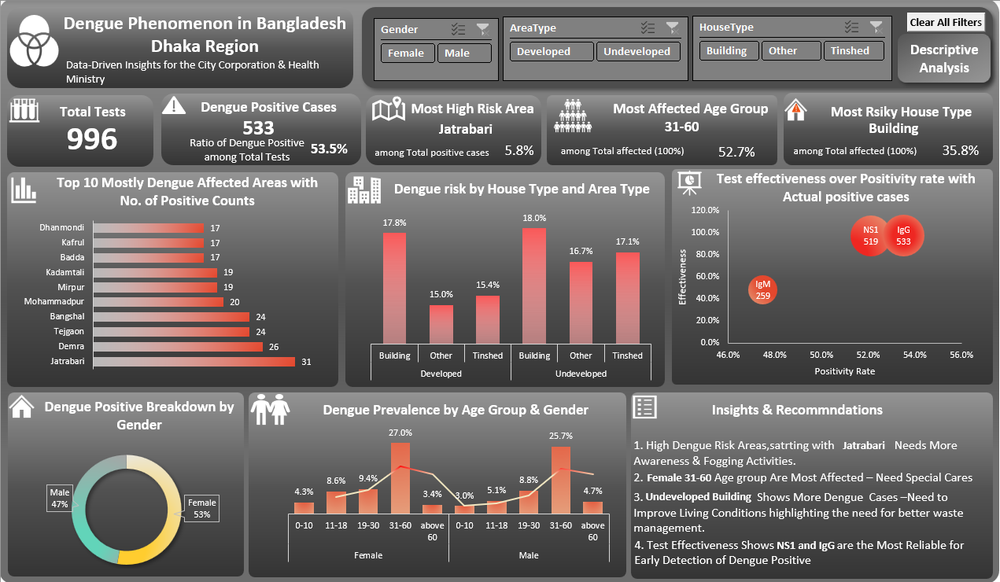
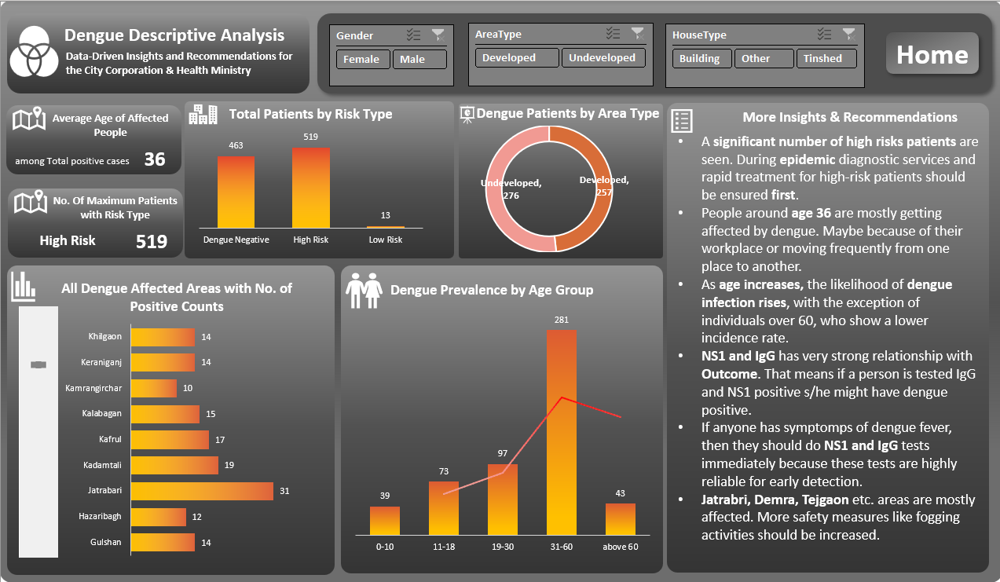

# Dengue Data Analysis Dashboard (Excel & Power BI)

## 📊 Project Overview
This project presents an interactive dashboard analyzing dengue cases in Dhaka, Bangladesh. Using advanced Excel functions, formulas, the data was processed, visualized, and transformed into meaningful insights to support health authorities in decision-making.

## 🔍 Key Insights
- **Jatrabari** is the most affected area, requiring urgent intervention.
- The **31-60 age group** is the most vulnerable, indicating the need for targeted healthcare efforts.
- **Buildings** have the highest risk among house types, highlighting poor living conditions.
- **NS1 and IgG tests** are the most effective for early dengue detection.

## 📌 Features
- **Data Processing:** Cleaned and structured data using Power Query and Excel formulas.
- **Visualization:** Created charts, graphs, and interactive elements for easy data interpretation.
- **Risk Analysis:** Identified high-risk zones and vulnerable groups using analytical techniques.
- **Actionable Insights:** Provided recommendations for dengue prevention and mitigation.

## 🛠️ Tools Used
- **Excel:** Power Query, Pivot Tables, Advanced Formulas(INDEX,MATCH,VLOOKUP,XLOOKUP etc.), Data Visualization

## 📷 Dashboard Snapshots



## 🚀 How to Use
1. Open the `Excel_Dashboard.xlsx` file to explore the analysis.
2. Review the insights and recommendations for a data-driven approach to dengue prevention.

## 📂 Repository Structure
```
├── Excel_Dashboard.xlsx
├── README.md
├── Images/
│   ├── Home Page.png
│   ├── Analysis Page.png
```

## ⚠️ Important Notes
- The view of the dashboard changes if it's opened in Google Sheets. The work has been done in Excel. Please check it on Excel.
- As macros have been used, please enable all content for them to work properly.
- Tried to make it as insightful as possible. I would appreciate your support in making much more insightful analyses and dashboards.

## 📢 Contact
For any questions or collaborations, feel free to reach out!

---

This repository is designed to provide health professionals with a data-driven approach to tackling dengue outbreaks. Contributions and suggestions are welcome!

